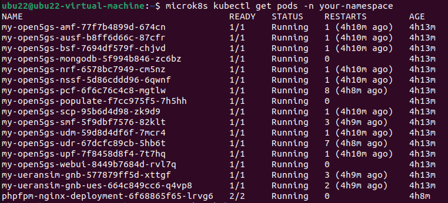
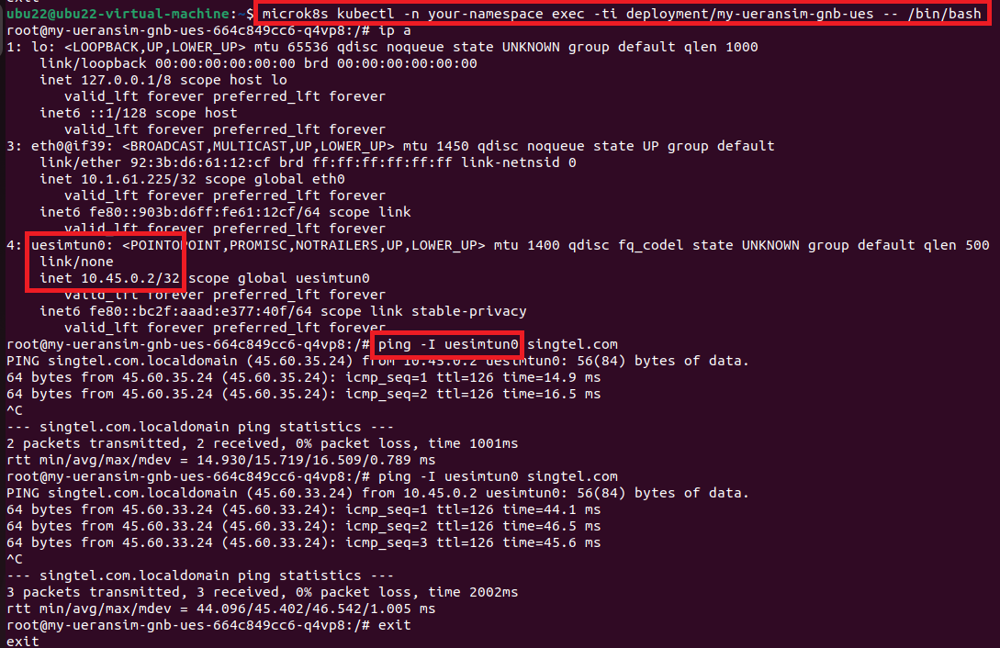

# 5G-playground

A Kubernetes-based 5G network simulation environment with integrated cybersecurity challenges. This playground provides a complete 5G standalone (SA) network using Open5GS and UERANSIM for educational and security research purposes.

## Prerequisites

Get ready an Ubuntu VM with:
- **At least 40GB of storage**
- **At least 8GB of RAM**
- **At least 4 cores**

**Highly recommended** to have a **clean snapshot of the VM** before proceeding with the installation.
 
Clone the GitHub project:
```bash
git clone https://github.com/hack-techv2/5G-playground.git
cd 5G-playground
```

## Quick Start

### 1. Environment Setup
```bash
# Make scripts executable
chmod +x ./scripts/k8s-combined.sh ./scripts/cleanup-k8s.sh

# Deploy the environment
./scripts/k8s-combined.sh
```

The combined script will:
- Install and configure microk8s
- Deploy the complete 5G network (Open5GS + UERANSIM)
- Set up vulnerable web application
- Configure all security challenges

### 2. Environment Cleanup
```bash
# Remove deployments but keep microk8s
./scripts/cleanup-k8s.sh --partial

# Complete removal including microk8s
./scripts/cleanup-k8s.sh --full
```

## Solutions and Walkthroughs

Challenge solutions and detailed walkthroughs can be found in the `solutions/` directory:

```bash
solutions/
├── challenge1-kubernetes-privilege-escalation.md   # Challenge 1 solution
├── challenge2-lateral-movement.md                  # Challenge 2 solution
├── challenge3-host-breakout.md                    # Challenge 3 solution
├── developer-shortcuts.md                         # Quick testing commands
└── detailed-walkthrough.pdf                      # Complete walkthrough
```

## Architecture

### 5G Core Network (Open5GS)
- **AMF** (Access and Mobility Management Function)
- **SMF** (Session Management Function) 
- **UPF** (User Plane Function)
- **AUSF** (Authentication Server Function)
- **UDM** (Unified Data Management)
- **UDR** (Unified Data Repository)
- **PCF** (Policy Control Function)
- **BSF** (Binding Support Function)
- **NRF** (NF Repository Function)
- **NSSF** (Network Slice Selection Function)
- **SCP** (Service Communication Proxy)
- **MongoDB** (Database)
- **WebUI** (Management Interface)

### RAN Simulator (UERANSIM)
- **gNodeB** (5G Base Station)
- **UE** (User Equipment)

### Network Configuration
- **PLMN**: MCC=999, MNC=70
- **Network Slice**: SST=1, SD=0x111111
- **Namespace**: playground

## Validation

### Check Pod Status
```bash
microk8s kubectl get pods -n playground
```

All pods should be in `Running` status:


### Test 5G Network Connectivity
```bash
# Access UE simulator
microk8s kubectl -n playground exec -ti deployment/my-ueransim-gnb-ues -- /bin/bash

# Inside the pod
ip a                        # Should show uesimtun0 interface
ping -I uesimtun0 1.1.1.1   # Test internet connectivity
```



## Troubleshooting

### Insufficient Permissions
```bash
sudo usermod -a -G microk8s $USER
sudo chown -R $USER ~/.kube
newgrp microk8s
```

### Manual Helm Upgrades
```bash
microk8s helm upgrade my-open5gs ./open5gs-2.2.3/open5gs --namespace playground --values ./helms/5gSA-values.yaml
microk8s helm upgrade my-ueransim-gnb ./ueransim-gnb-0.2.6/ueransim-gnb --namespace playground --values ./helms/my-gnb-ues-values.yaml
microk8s helm upgrade phpfpm-nginx-release ./phpfpm-nginx-chart --namespace playground
```

### Common Issues
- **Pods stuck in Pending**: Check resource availability and storage
- **Network connectivity issues**: Verify MetalLB configuration and IP ranges

## Project Structure

```
5G-playground/
├── scripts/                 # Installation and setup scripts
│   ├── k8s-combined.sh     # Main deployment script
│   ├── cleanup-k8s.sh      # Environment cleanup
│   └── ctfd-*              # CTF platform files
├── open5gs-2.2.3/          # 5G Core Network Helm charts
├── ueransim-gnb-0.2.6/     # RAN simulator Helm charts  
├── php1/                   # Vulnerable web application
├── phpfpm-nginx-chart/     # Web server Helm chart
├── helms/                  # Configuration values
└── solutions/              # Challenge solutions and guides
```

## Contributing

This playground is designed for educational and research purposes. Contributions for new challenges, improved documentation, or bug fixes are welcome.

## License

Educational use only. Please ensure proper authorization before using these tools and techniques.
